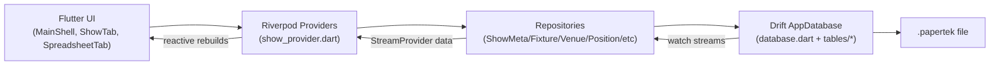

# PaperTek Architecture One-Pager

## System Map

## Layer Responsibilities

- **UI Layer (`papertek/lib/ui`)**
  - Renders screens and widgets.
  - Emits user intents (add/edit/filter/sort).
  - Avoids direct SQL/Drift access.

- **State Wiring Layer (`papertek/lib/providers/show_provider.dart`)**
  - Holds active database handle (`databaseProvider`).
  - Creates repositories from the current DB.
  - Exposes reactive stream providers (`fixtureRowsProvider`, etc.).

- **Data Access Layer (`papertek/lib/repositories`)**
  - Encapsulates query/write logic by domain.
  - Maps DB records into richer row models (`FixtureRow`).
  - Owns domain write semantics (e.g., fixture vs part field routing).

- **Persistence Layer (`papertek/lib/database`)**
  - Drift table definitions and migrations.
  - Schema lifecycle management (currently v12).
  - Backfills and compatibility logic during upgrades.

## Architectural Decisions in Current Code

- Single active show DB context drives app mode and all domain providers.
- Repository-per-domain keeps writes/reads from leaking into UI.
- DB stream reactivity is primary refresh mechanism (no polling model).
- Spreadsheet edit flow is stabilized by minimizing rebuild interference during edit mode.
- Schema version upgrades are first-class, with explicit migration path and data backfill steps.

## Communication Patterns

- **Read path**
  - UI -> StreamProvider -> Repository `watch*` -> Drift `watch()`.
- **Write path**
  - UI intent -> repository update method -> Drift write -> stream emits -> UI refreshes.
- **Cross-widget sync**
  - Spreadsheet grid + sidebar synchronize selection state without forcing full edit rebuilds.

## Extension Guidance

- Add domain features by:
  1. table/migration changes
  2. repository read/write APIs
  3. provider exposure
  4. UI integration
- Keep business rules in repositories; keep UI logic mostly interaction-focused.
