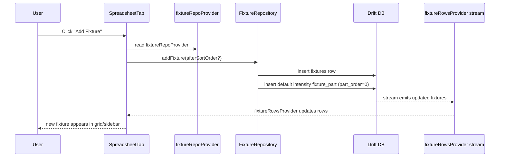
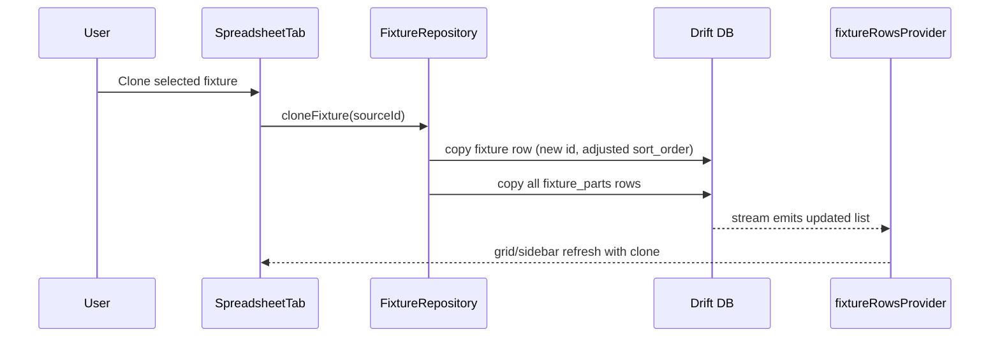
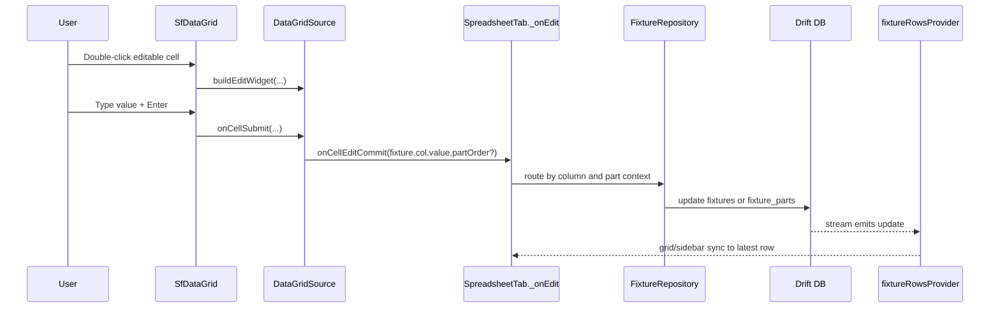
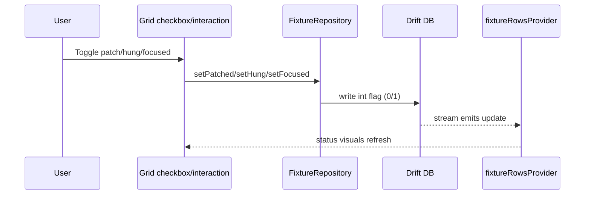
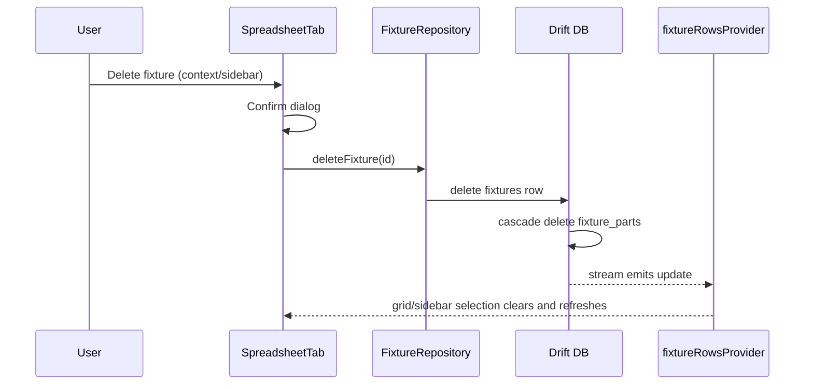

# Fixture Lifecycle Walkthrough

## 1) Create Fixture

### Create path details

- Entry point: spreadsheet action button (`_addFixture`).
- Repository allocates `sort_order` intelligently (append or midpoint insertion).
- New fixture always gets baseline intensity part row for immediate editability.
- Reactive stream update is the source of truth for UI refresh.

---

## 2) Clone Fixture

### Clone specifics

- Copies fixture-level and all part-level data.
- Unit number may auto-increment when present.
- Preserves patch/network part data in clone.

---

## 3) Edit Fixture (Grid Cell)

### Edit routing rules

- **Fixture-level fields** (`position`, `unit`, `type`, `function`, `focus`, `accessories`) -> `fixtures`.
- **Patch/network fields** (`chan`, `dimmer/address`, `circuit`, `ip`, `subnet`, `mac`, `ipv6`) -> `fixture_parts`.
- **Multipart rows**
  - Parent row = fixture-level context.
  - Child row = part-specific updates (uses `partOrder`).

---

## 4) Toggle Status Booleans

---

## 5) Delete Fixture

---

## Lifecycle Reliability Notes

- Stream updates are intentionally deferred during active grid edit to avoid collapsing editor state.
- Selection and sidebar sync are updated from grid focus/tap activation paths.
- Column visibility/ordering and UI state are maintained separately from persisted fixture data.
