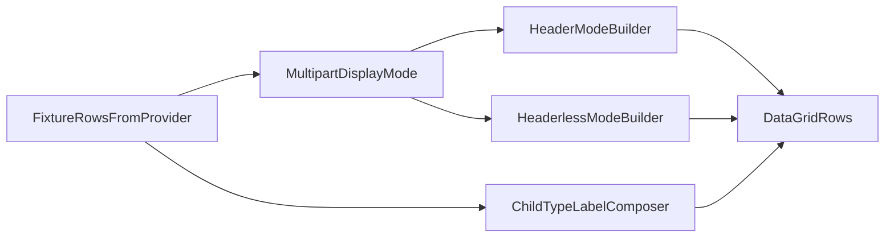

# Multipart Display Modes (Header + Headerless)

## Recommendation
Implement **spreadsheet-first** for behavior-critical sorting/flattening, while adding shared model/data-shaping changes now so reports can adopt the same semantics cleanly. This is the best architectural split because spreadsheet and report rendering do not share row-flattening logic today.

## Current Architecture Findings
- Spreadsheet multipart flattening/sorting is in [C:/Users/artwh/Downloads/Illuminati/papertek/lib/ui/spreadsheet/fixture_data_source.dart](C:/Users/artwh/Downloads/Illuminati/papertek/lib/ui/spreadsheet/fixture_data_source.dart).
- Spreadsheet sort/view state is in [C:/Users/artwh/Downloads/Illuminati/papertek/lib/ui/spreadsheet/spreadsheet_view_controller.dart](C:/Users/artwh/Downloads/Illuminati/papertek/lib/ui/spreadsheet/spreadsheet_view_controller.dart).
- Toolbar toggle UI is in [C:/Users/artwh/Downloads/Illuminati/papertek/lib/ui/spreadsheet/widgets/toolbar.dart](C:/Users/artwh/Downloads/Illuminati/papertek/lib/ui/spreadsheet/widgets/toolbar.dart), wired from [C:/Users/artwh/Downloads/Illuminati/papertek/lib/ui/spreadsheet/spreadsheet_tab.dart](C:/Users/artwh/Downloads/Illuminati/papertek/lib/ui/spreadsheet/spreadsheet_tab.dart).
- Reports consume `fixtureRowsProvider` but render separately in [C:/Users/artwh/Downloads/Illuminati/papertek/lib/features/reports/template_renderer.dart](C:/Users/artwh/Downloads/Illuminati/papertek/lib/features/reports/template_renderer.dart), so spreadsheet fixes are not automatically inherited.

## Target Behaviors to Codify
1. **Display with header**
   - Parent row is shown.
   - Child rows render under parent.
   - Sorts move each multipart fixture as one locked unit.
2. **Headerless**
   - Parent row is hidden for multipart fixtures.
   - Each part behaves like an independent row for sorting (can split naturally by channel).
3. **Reusable type label rule**
   - Subpart type displays as `"<ParentFixtureType> <PartName>"` (fallback if missing part name).

## Implementation Plan

### 1) Add explicit multipart display mode state (spreadsheet UI + controller)
- In [C:/Users/artwh/Downloads/Illuminati/papertek/lib/ui/spreadsheet/spreadsheet_view_controller.dart](C:/Users/artwh/Downloads/Illuminati/papertek/lib/ui/spreadsheet/spreadsheet_view_controller.dart):
  - Add enum/state: `MultipartDisplayMode.header` / `MultipartDisplayMode.headerless`.
  - Add setter and notifier.
  - Persist to preset JSON (same pattern as `groupBySort1`) so QA can reliably repro modes.
- In [C:/Users/artwh/Downloads/Illuminati/papertek/lib/ui/spreadsheet/widgets/toolbar.dart](C:/Users/artwh/Downloads/Illuminati/papertek/lib/ui/spreadsheet/widgets/toolbar.dart):
  - Add second checkbox next to `Group By Sort 1` (temporary testing control).
- In [C:/Users/artwh/Downloads/Illuminati/papertek/lib/ui/spreadsheet/spreadsheet_tab.dart](C:/Users/artwh/Downloads/Illuminati/papertek/lib/ui/spreadsheet/spreadsheet_tab.dart):
  - Wire checkbox value/callback to controller state.

### 2) Extend part model for reusable child type labeling
- In [C:/Users/artwh/Downloads/Illuminati/papertek/lib/repositories/fixture_repository.dart](C:/Users/artwh/Downloads/Illuminati/papertek/lib/repositories/fixture_repository.dart):
  - Add `partName` (and optionally `partType`) to `FixturePartRow` from `fixture_parts.part_name`.
  - Keep DB schema unchanged.
- In [C:/Users/artwh/Downloads/Illuminati/papertek/lib/ui/spreadsheet/column_spec.dart](C:/Users/artwh/Downloads/Illuminati/papertek/lib/ui/spreadsheet/column_spec.dart):
  - For `type` column, provide child-row display value as `"<fixtureType> <partName>"` with safe fallback (`partOrder` label when name missing).
- This change is reusable by reports when they begin rendering per-part rows.

### 3) Refactor spreadsheet flattening into mode-aware builders
- In [C:/Users/artwh/Downloads/Illuminati/papertek/lib/ui/spreadsheet/fixture_data_source.dart](C:/Users/artwh/Downloads/Illuminati/papertek/lib/ui/spreadsheet/fixture_data_source.dart):
  - Split `_rebuildFilteredRows()` flattening into mode-specific branches:
    - `header` branch: emit parent then children.
    - `headerless` branch: emit one row per part for multipart fixtures, no parent row.
  - Keep single-part fixtures unchanged in both modes.

### 4) Enforce sorting semantics per mode (core requirement)
- **Header mode (locked unit):**
  - Sort at fixture level before flattening, then append child rows directly after parent.
  - Ensure no child-level key in sort can separate rows from parent.
- **Headerless mode (independent parts):**
  - Construct sortable row units per part, using part-level values for sort columns where applicable.
  - Sort those row units directly, then materialize `DataGridRow`s in sorted order.
- Keep existing filter/search behavior consistent by applying them before mode-specific flattening.

### 5) Edit-path correctness in both modes
- Ensure row metadata (`_rowToFixture`, `_rowToPartOrder`) remains correct for both flattening strategies.
- Validate child edits route `partOrder` only for part-level columns and fixture-level edits still hit parent fixture fields.

### 6) Reports architecture decision checkpoint (small, explicit)
- After spreadsheet mode behavior is stable, do a scoped pass to estimate report delta:
  - If report can reuse new row-unit builder with minimal adapter: include now.
  - If not, defer report mode switch to a focused follow-up to avoid coupling spreadsheet datasource into PDF renderer.
- Shared type-label change already lands now, so report follow-up stays smaller.

## Verification Plan
1. Header mode ON:
   - multipart parent + children render as a block.
   - sorting by channel keeps each block contiguous.
2. Headerless mode ON:
   - multipart parents disappear.
   - each part sorts independently and can separate naturally.
3. Type column:
   - child rows show `ParentType + PartName`.
4. Group By Sort compatibility:
   - behavior is deterministic in both modes with grouping ON/OFF.
5. Preset persistence:
   - both `groupBySort1` and multipart mode restore correctly.
6. Regression:
   - selection/edit/open collection flows still work.

## What Is Hard / Tech Debt
- **Dual row semantics in one datasource:** one class now owns two materially different flatten/sort pipelines. Without extraction, complexity grows quickly.
- **Sort correctness edge cases:** headerless mode requires careful column-by-column choice of parent vs part value; mistakes produce surprising ordering.
- **Grouping interaction matrix:** grouping + mode + sort-level changes can produce subtle visual states and support burden.
- **Preset schema drift:** adding more view-mode flags to untyped JSON increases silent-compatibility risk over time.
- **Reports duplication risk:** spreadsheet and PDF pipelines are separate today; implementing identical behavior twice can drift unless shared row-unit abstractions are introduced.

## Debt Mitigation (recommended while implementing)
- Introduce internal row-unit structs (e.g., `DisplayRowUnit`) in datasource now, even if only spreadsheet uses them initially.
- Centralize “value for sort/display by mode” helper functions to avoid copy/paste logic.
- Add targeted unit tests around ordering decisions for both modes with mixed part names/channels.

