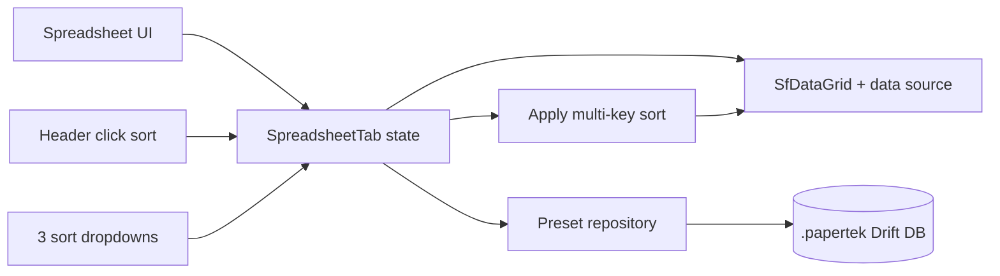

# Spreadsheet Multi-Sort + ViewPreset Plan

## Scope
Implement advanced spreadsheet sorting and persistent view presets in the spreadsheet UI, while preserving current interactions:
- 3 dropdown sort levels (primary/secondary/tertiary), each with asc/desc toggle.
- Header click still sorts, but now sets primary sort and clears secondary/tertiary.
- Preset buttons at bottom for `Patch by Channel`, `Patch by Address`, `Position View`, plus `+` (new preset) and `Update`.
- Presets persist inside the `.papertek` DB (per-show, portable with file).

## Current Architecture (what we are extending)
- Spreadsheet UI/state lives in [`c:/Users/artwh/Downloads/Illuminati/papertek/lib/ui/spreadsheet/spreadsheet_tab.dart`](c:/Users/artwh/Downloads/Illuminati/papertek/lib/ui/spreadsheet/spreadsheet_tab.dart).
- Active grid path is minimal mode (`_kMinimalSpreadsheetMode = true`), with sorting enabled on `SfDataGrid` header clicks.
- Column widths currently persist via `SharedPreferences`; column visibility/order/sort do not persist.
- Show DB schema + migrations are in [`c:/Users/artwh/Downloads/Illuminati/papertek/lib/database/database.dart`](c:/Users/artwh/Downloads/Illuminati/papertek/lib/database/database.dart).

## Data Model Design (chosen)
Use a **new table** for presets (seed editable built-ins):
- New table file: [`c:/Users/artwh/Downloads/Illuminati/papertek/lib/database/tables/spreadsheet_view_presets.dart`](c:/Users/artwh/Downloads/Illuminati/papertek/lib/database/tables/spreadsheet_view_presets.dart)
- Columns:
  - `id` PK
  - `name` (`TEXT NOT NULL`)
  - `isSystem` (`INT NOT NULL DEFAULT 0`) for seeded built-ins
  - `createdAt`, `updatedAt` (`TEXT ISO8601`)
  - `presetJson` (`TEXT NOT NULL`)
- JSON payload (`version: 1`):
  - `columnOrder: string[]`
  - `hiddenColumns: string[]`
  - `columnWidths: map<string,double>`
  - `sorts: [{column:string, direction:"asc"|"desc"}]` (0..3)

Why this shape:
- Keeps presets file-portable per show.
- Supports many named presets cleanly.
- Avoids overloading `show_meta` with one giant mutable blob.

## Migration + DB Integration
Update DB wiring in [`c:/Users/artwh/Downloads/Illuminati/papertek/lib/database/database.dart`](c:/Users/artwh/Downloads/Illuminati/papertek/lib/database/database.dart):
- Import and register `SpreadsheetViewPresets` in Drift table list.
- Bump schema version and add `if (from < N) createTable(spreadsheetViewPresets)`.
- **Also fix existing schema-version mismatch** (`currentSchemaVersion` vs `schemaVersion`) before adding this migration to avoid version confusion.

Seed built-ins once per new/opened show (idempotent):
- `Patch by Channel`
- `Patch by Address`
- `Position View`

## Repository + Provider Layer
Add repository for clean IO boundary:
- New repository: [`c:/Users/artwh/Downloads/Illuminati/papertek/lib/repositories/spreadsheet_view_preset_repository.dart`](c:/Users/artwh/Downloads/Illuminati/papertek/lib/repositories/spreadsheet_view_preset_repository.dart)
- Responsibilities:
  - list/watch presets
  - create preset
  - update preset
  - seed defaults if absent
- Add provider in [`c:/Users/artwh/Downloads/Illuminati/papertek/lib/providers/show_provider.dart`](c:/Users/artwh/Downloads/Illuminati/papertek/lib/providers/show_provider.dart)

## Spreadsheet UI/State Changes
Primary work in [`c:/Users/artwh/Downloads/Illuminati/papertek/lib/ui/spreadsheet/spreadsheet_tab.dart`](c:/Users/artwh/Downloads/Illuminati/papertek/lib/ui/spreadsheet/spreadsheet_tab.dart):

### 1) Introduce explicit sort state
- Add `SortSpec` model in file scope (or small local class) with `{column, direction}`.
- Track `List<SortSpec> _sortSpecs` (max 3).
- Add helpers:
  - `_setPrimarySortFromHeaderClick(column)` => primary asc, clear level2/3
  - `_setSortLevel(level, column)` => set level asc if new column
  - `_toggleSortDirection(level)`
  - `_normalizeSortSpecs()` (remove duplicates/hidden columns)

### 2) Apply multi-key sort to active data source
- Extend minimal source sorting path to sort fixture rows by `_sortSpecs` in precedence order.
- Keep current fixture/part row grouping behavior intact.
- Comparator rules:
  - numeric-aware for numeric columns (existing behavior parity)
  - case-insensitive string compare for text
  - deterministic tiebreaker fallback (e.g., id/sort_order) for stable results

### 3) Keep header-click behavior (as requested)
- Intercept header sort change event (Syncfusion callback) and route to `_setPrimarySortFromHeaderClick`.
- Ensure this resets dropdown levels 2/3 and sets level 1 ascending.
- Preserve visible sort indicators in header.

### 4) Add top sort-control strip
- Above grid: 3 compact controls (`1st`, `2nd`, `3rd`) using currently visible columns only.
- Each control has:
  - property dropdown (visible column labels)
  - asc/desc icon toggle
- Selecting a property auto-sets asc.

### 5) Add bottom presets strip
- Button row under spreadsheet:
  - seeded preset buttons
  - `+` button for save-new preset dialog (name entry)
  - `Update` button for active preset overwrite
- Active preset visual states:
  - **Dim orange** when active and clean
  - **Bright yellow** when active preset is dirty (layout/sort changed since load/save)
- Dirty tracking should react to:
  - hidden columns changes
  - column order changes
  - width changes
  - sort changes

### 6) Preset apply/save behavior
- Apply preset updates all layout/sort state in one transaction-like `setState` block.
- Saving/updating recalculates dirty baseline from normalized state snapshot.
- Remove/replace current SharedPreferences width persistence for this view path so DB preset is source-of-truth (or keep temporary fallback only for migration period).

## Safety + Edge Cases
- Hidden column currently used in sort: either auto-remove from sort or keep hidden-sort semantics (recommend auto-remove + toast/snackbar).
- Duplicate sort columns across levels: auto-deduplicate by first occurrence.
- Preset references removed/renamed columns: ignore invalid entries gracefully.
- Empty/partial sort definitions should still work and maintain stable ordering.
- Ensure loading presets does not trigger recursive dirty state flips.

## Validation Checklist
- Header click on any sortable column sets primary asc and clears level2/3.
- Dropdown level changes reorder data immediately.
- Direction toggles update order immediately.
- Built-in presets are seeded once and are editable via `Update`.
- `+` saves a new named preset and makes it active.
- Dirty indicator transitions:
  - clean (dim orange) after apply/update/save
  - bright yellow after any manual layout/sort edit
- Reopen same `.papertek` file: presets persist and reapply correctly.

## Implementation Notes for Fast Execution
- Keep changes concentrated to 5 files max in first pass:
  - [`c:/Users/artwh/Downloads/Illuminati/papertek/lib/database/database.dart`](c:/Users/artwh/Downloads/Illuminati/papertek/lib/database/database.dart)
  - [`c:/Users/artwh/Downloads/Illuminati/papertek/lib/database/tables/spreadsheet_view_presets.dart`](c:/Users/artwh/Downloads/Illuminati/papertek/lib/database/tables/spreadsheet_view_presets.dart)
  - [`c:/Users/artwh/Downloads/Illuminati/papertek/lib/repositories/spreadsheet_view_preset_repository.dart`](c:/Users/artwh/Downloads/Illuminati/papertek/lib/repositories/spreadsheet_view_preset_repository.dart)
  - [`c:/Users/artwh/Downloads/Illuminati/papertek/lib/providers/show_provider.dart`](c:/Users/artwh/Downloads/Illuminati/papertek/lib/providers/show_provider.dart)
  - [`c:/Users/artwh/Downloads/Illuminati/papertek/lib/ui/spreadsheet/spreadsheet_tab.dart`](c:/Users/artwh/Downloads/Illuminati/papertek/lib/ui/spreadsheet/spreadsheet_tab.dart)
- Implement sorting + preset serialization utilities near spreadsheet state first; wire UI second; persistence third.
- Add small pure functions for state snapshot normalization to keep dirty detection reliable and testable.
